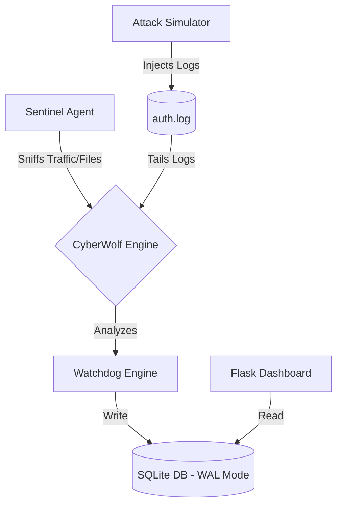

# 🐺 CyberWolf SIEM

CyberWolf SIEM is a lightweight, modular **Security Information and Event Management** system designed for real-time threat detection, network monitoring, and security visualization. It combines a high-performance detection engine with a futuristic web dashboard to provide a comprehensive Security Operations Center (SOC) experience on your desktop.

---

## 🚀 Key Features

### 🛡️ 1. Multi-Vector Threat Engine
The core logic (Watchdog) analyzes logs and traffic across 8 distinct attack vectors:
- **SQL Injection:** Detects Union-based, tautology (`OR 1=1`), and time-based blind injections.
- **Brute Force:** Tracks failed login attempts with configurable time windows and thresholds.
- **Network Reconnaissance:** Identifies port scanning and signatures from tools like Nmap or Masscan.
- **Ransomware Protection:** Monitors for massive file modifications, shadow copy deletions, and suspicious extensions (e.g., `.locked`, `.crypt`).
- **DDoS Detection:** Identifies volumetric traffic floods (Inbound Flood).
- **Credential Stuffing:** Detects login attempts across multiple unique accounts from a single source.
- **Privilege Escalation:** Monitors for unauthorized `sudo` attempts, SUID modifications, and kernel exploit signatures.
- **Access Abuse:** Tracks unauthorized access to sensitive system files like `/etc/shadow` or `.env`.

### 🛰️ 2. Real-Time Sentinel Agent
A dual-purpose agent that performs:
- **HIDS (Host IDS):** Monitors file integrity (FIM) and local Windows/Linux security event logs.
- **NIDS (Network IDS):** Uses Scapy to sniff raw network packets and analyze payloads for malicious signatures.

### 📊 3. Futuristic SOC Dashboard
A Flask-based web interface featuring:
- **Live Feed:** Real-time security event updates without page refreshes.
- **Threat Intensity Charts:** Visual distribution of attack types using Chart.js.
- **System Health:** Quick stats for total logs, active alerts, and failed access attempts.
- **Cyberpunk Aesthetic:** CRT scanline effects and neon-coded severity levels.

---

## 🏗️ Architecture



---

## 🛠️ Installation

### Prerequisites
- Python 3.8+
- Linux (Kali/Ubuntu preferred for Scapy) or Windows
- Admin/Sudo privileges (required for network sniffing)

### Setup
1. **Clone the repository:**
   ```bash
   git clone https://github.com/your-username/projet_mini_SIEM.git
   cd projet_mini_SIEM
   ```

2. **Create a Virtual Environment:**
   ```bash
   python3 -m venv venv
   source venv/bin/activate  # Windows: venv\Scripts\activate
   ```

3. **Install Dependencies:**
   ```bash
   pip install -r requirements.txt
   ```

4. **Initialize the Database:**
   ```bash
   python3 init_db.py
   ```

---

## 🚦 Usage

### Quick Start (Linux)
Run the automated launcher to start all modules (Dashboard, Engine, Simulator, and Sentinel) in separate terminal tabs:
```bash
python3 start_siem_linux.py
```

### Manual Start
If you prefer to run modules individually:
- **Start the Web SOC:** `python3 app.py`
- **Start the Core Monitor:** `python3 main.py`
- **Start the Attack Simulator:** `python3 attack_simulator.py`
- **Start the Sentinel Agent:** `sudo venv/bin/python3 modules/RealTime_System_Monitor.py`

**Access the Dashboard at:** `http://127.0.0.1:5000`

---

## ⚙️ Configuration
Modify `config.json` to tune detection sensitivity:
- `bruteforce_threshold`: Number of failed logins before alerting.
- `time_window_seconds`: Time frame for correlation.
- `refresh_interval`: Dashboard sync rate.

---

## 🔒 Security Note
This project is intended for **educational and defensive research purposes only**. The attack simulator generates fake logs for testing. Always obtain permission before monitoring network traffic on hardware you do not own.

---
**Author:** CyberWolf Development Team  
**License:** MIT
